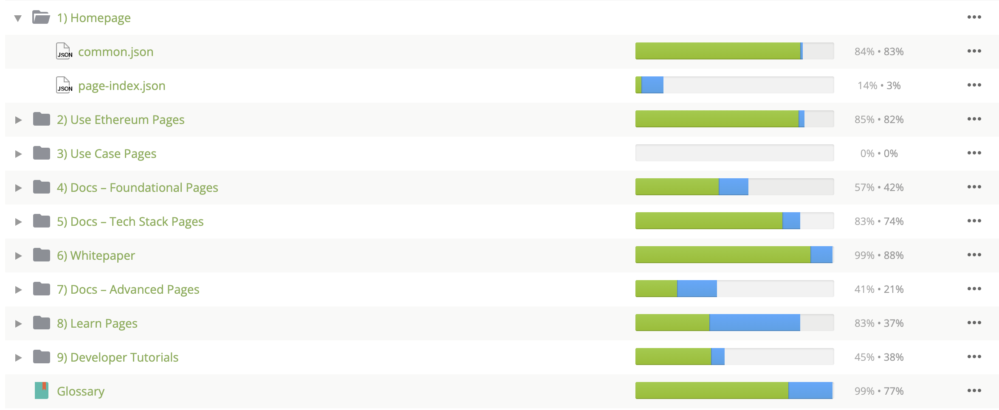

# Translation Program {#translation-program}

The Translation Program is a collaborative effort to translate ethereum.org into different languages in order to make the website more accessible to billions of non-English speakers around the world.

Our progress so far:

- **2,000 +** translators
- **37** languages live on site
- **1.9 million** words translated in 2021

If you want to get involved and help us grow the global Ethereum community by translating the website into your language, follow the steps below!

<InfoBanner shouldCenter emoji=":tada:">
  Claim your POAP token! If you translated ethereum.org in 2021, there's a unique POAP waiting for you.{" "}
  <a href="https://ethereum.org/en/contributing/#poap">More on POAPs</a>
</InfoBanner>

## How to translate {#how-to-translate}

1. **[Join our project on Crowdin](https://crowdin.com/project/ethereum-org/invite)**  
   You will need to log in to your Crowdin account or sign up if you don’t already have one. All that is required to sign up is an e-mail account and password.

2. **Open the language you want to translate and find a document to work on**  
   The website content is divided into a number of documents and language versions. You can check the progress of each document on the right – if translation progress is below 100%, please contribute!

   Don't see your language listed? [Open an issue](https://github.com/ethereum/ethereum-org-website/issues/new/choose)

   

   A note on content versions: we use version management within Crowdin to avoid translation delays for added content. When you check out a language, for example, [Filipino](https://crowdin.com/project/ethereum-org/fil#) you'll see folders for each site version ("v2.0", "v2.1", etc.).

   We encourage you to translate the lowest version first and work your way up to higher versions (v.2.0 → v.2.1 → v.2.2 → ⋯) as lower versions will be updated on the site first.

   [Learn more about ethereum.org content versions](/en/contributing/translation-program/content-versions/)

3. **Translate**  
   After selecting the file you want to translate, it will open in the online editor. If you have never used Crowdin before, you can use this quick guide to go over the basics.

   

   **_1 – Left sidebar_**

   - Untranslated (red) – text that has not been worked on yet. These are the strings that you should be translating.
   - Translated (green) – text that has already been translated, but not yet reviewed. You are welcome to suggest alternate translations, or vote on existing ones using the ‘’+’’ and ‘’-‘‘ buttons in the editor.
   - Approved (check mark) – text that has already been reviewed and is currently live on the website.

   You can also use the buttons on top to search for specific strings, filter them by status or change the view.

   **_2 – Editor area_**

   The main translation area – source text is displayed on top, with additional context and screenshots, if available.
   To suggest a new translation, enter your translation in the ‘’Enter translation here’’ field and click Save.

   You can also find existing translations of the string and translations into other languages in this section, as well as translation memory matches and machine translation suggestions.

   **_3 – Right sidebar_**

   This is where you can find comments, translation memory entries and glossary entries. The default view shows the comments and allows translators to communicate, raise issues or report incorrect translations.

   By using the buttons on top, you can also switch to the Translation Memory, where you can search for existing translations, or to the Glossary, which contains descriptions and standard translations of key terms.

   Want to learn more? Feel free to check out the [documentation on using the Crowdin online editor](https://support.crowdin.com/online-editor/)

4. **Review process**  
   Once you've completed the translation (i.e. all files for a content version display 100%), our professional translation service will review (and potentially edit) the content. Once the review is complete (i.e. review progress is 100%), we will add it to the website.

Do you have any questions? Or want to collaborate with our team and other translators? Please post in the #translations channel of our [ethereum.org Discord server](https://discord.gg/6WX7E97)

You can also reach out to us at translations@ethereum.org

Thank you for your participation in the ethereum.org Translation Program!

<InfoBanner shouldCenter emoji=":information_source:">
  If you're helping us with translations, you might find some useful information in our translations FAQ. 
  {" "}<a href="/en/contributing/translation-program/translation-guide/">Translating ethereum.org FAQ</a>
</InfoBanner>

## Resources {#resources}

**Tools**

- [Microsoft Language Portal](https://www.microsoft.com/en-us/language)
  _– useful for finding and checking the standard translations of technical terms_
- [Linguee](https://www.linguee.com/)
  _– search engine for translations and dictionary that enables searching by word or phrase_
- [Proz term search](https://www.proz.com/search/)
  _– database of translation dictionaries and glossaries for specialized terms_
- [Eurotermbank](https://www.eurotermbank.com/)
  _– collections of European terminology in 42 languages_

**Communities**

- [Language-specific Translation Groups](https://discord.gg/6WX7E97)
  _– an initiative to connect ethereum.org translators into Translation Groups_
- [Chinese translators group](https://www.notion.so/Ethereum-org-05375fe0a94c4214acaf90f42ba40171)
  _– Notion page for easier coordination between Chinese translators_

**Versions overview**

- [Content versions](/contributing/translation-program/content-versions/) _– Which pages are included in each content version of ethereum.org_

## Ethereum Staking Launchpad translations {#staking-launchpad}

Our translation community is also working on the [Staking Launchpad](https://launchpad.ethereum.org/en/). This allows anyone to set up an Ethereum validator and help secure the Ethereum network. The Launchpad is currently live in 17 languages.

If you're interested, [join the Ethereum Staking Launchpad translation project on Crowdin](https://crowdin.com/project/ethereum-staking-launchpad). You can [create an issue](https://github.com/ethereum/staking-launchpad/issues/new) on GitHub to request the addition of a new language, if your language is not available on Crowdin.

## In-progress translations {#in-progress}

<TranslationsInProgress />
