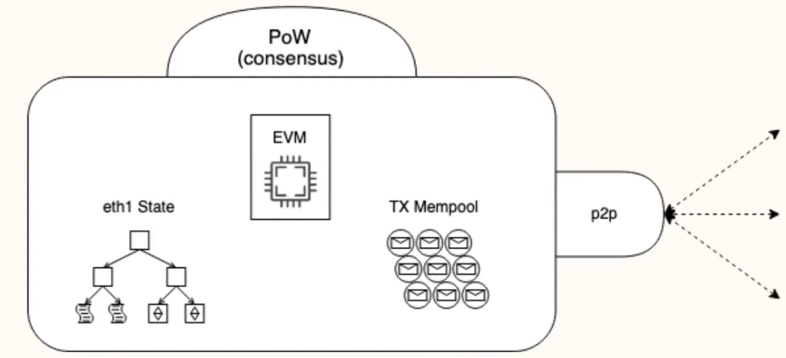
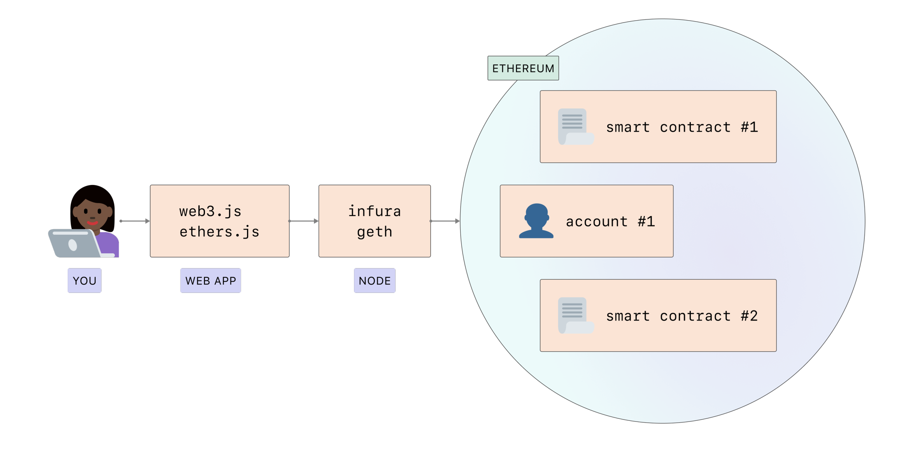
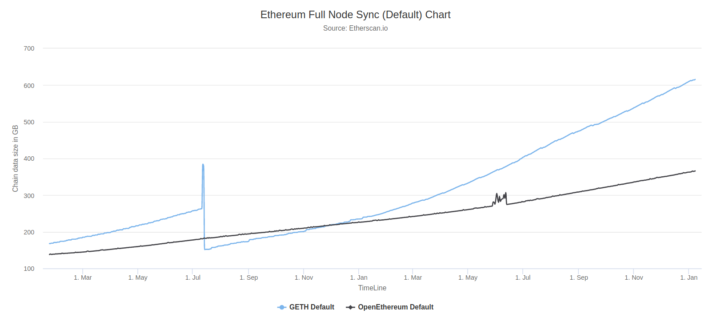
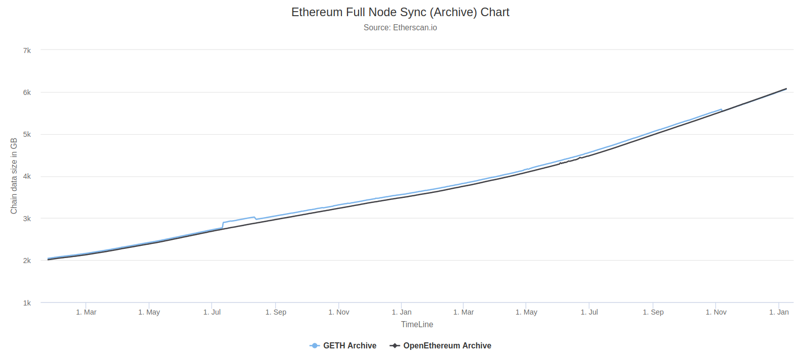

Ethereum is a distributed network of computers running software (known as nodes) that can verify blocks and transaction data. You need an application, known as a client, on your computer to "run" a node.

## Prerequisites {#prerequisites}

You should understand the concept of a peer-to-peer network and the [basics of the EVM](/developers/docs/evm/) before diving deeper and running your own instance of an Ethereum client. Take a look at our [introduction to Ethereum](/developers/docs/intro-to-ethereum/).

## What are nodes and clients? {#what-are-nodes-and-clients}

"Node" refers to a running piece of client software. A client is an implementation of Ethereum that verifies all transactions in each block, keeping the network secure and the data accurate.

You can see a real-time view of the Ethereum network by looking at this [map of nodes](https://etherscan.io/nodetracker).

Many [Ethereum clients](/developers/docs/nodes-and-clients/#clients) exist, in a variety of programming languages such as Go, Rust, JavaScript, Python, C# .NET and Java. What these implementations have in common is they all follow a formal specification (originally the [Ethereum Yellow Paper](https://ethereum.github.io/yellowpaper/paper.pdf)). This specification dictates how the Ethereum network and blockchain functions.

Simplified diagram of what Ethereum client features.

## Node types {#node-types}

If you want to [run your own node](/developers/docs/nodes-and-clients/run-a-node/), you should understand that there are different types of node that consume data differently. In fact, clients can run 3 different types of node - light, full and archive. There are also options of different sync strategies which enables faster synchronization time. Synchronization refers to how quickly it can get the most up-to-date information on Ethereum's state.

### Full node {#full-node}

- Stores full blockchain data.
- Participates in block validation, verifies all blocks and states.
- All states can be derived from a full node.
- Serves the network and provides data on request.

### Light node {#light-node}

- Stores the header chain and requests everything else.
- Can verify the validity of the data against the state roots in the block headers.
- Useful for low capacity devices, such as embedded devices or mobile phones, which can't afford to store gigabytes of blockchain data.

### Archive node {#archive-node}

- Stores everything kept in the full node and builds an archive of historical states. Needed if you want to query something like an account balance at block #4,000,000, or simply and reliably [test your own transactions set without mining them using OpenEthereum](https://openethereum.github.io/JSONRPC-trace-module#trace_callmany).
- These data represent units of terabytes which makes archive nodes less attractive for average users but can be handy for services like block explorers, wallet vendors, and chain analytics.

Syncing clients in any mode other than archive will result in pruned blockchain data. This means, there is no archive of all historical states but the full node is able to build them on demand.

## Why should I run an Ethereum node? {#why-should-i-run-an-ethereum-node}

Running a node allows you to trustlessly and privately use Ethereum while supporting the ecosystem.

### Benefits to you {#benefits-to-you}

Running your own node enables you to use Ethereum in a truly private, self-sufficient and trustless manner. You don't need to trust the network because you can verify the data yourself with your client. "Don't trust, verify" is a popular blockchain mantra.

- Your node verifies all the transactions and blocks against consensus rules by itself. This means you don’t have to rely on any other nodes in the network or fully trust them.
- You won't have to leak your addresses and balances to random nodes. Everything can be checked with your own client.
- Your dapp can be more secure and private if you use your own node. [Metamask](https://metamask.io), [MyEtherWallet](https://myetherwallet.com) and some other wallets can be easily pointed to your own local node.
- You can program your own custom RPC endpoints.
- You can connect to your node using **Inter-process Communications (IPC)** or rewrite the node to load your program as a plugin. This grants low latency, which is required to replace your transactions as fast as possible (i.e. frontrunning).

### Network benefits {#network-benefits}

A diverse set of nodes is important for Ethereum’s health, security and operational resiliency.

- They provide access to blockchain data for lightweight clients that depend on it. In high peaks of usage, there need to be enough full nodes to help light nodes sync. Light nodes don't store the whole blockchain, instead they verify data via the [state roots in block headers](/developers/docs/blocks/#block-anatomy). They can request more information from blocks if they need it.
- Full nodes enforce the proof-of-work consensus rules so they can’t be tricked into accepting blocks that don't follow them. This provides extra security in the network because if all the nodes were light nodes, which don't do full verification, miners could attack the network and, for example, create blocks with higher rewards.

If you run a full node, the whole Ethereum network benefits from it.

## Running your own node {#running-your-own-node}

Interested in running your own Ethereum client? Learn how to [spin up your own node](/developers/docs/nodes-and-clients/run-a-node/)!

### Projects {#projects}

[**Select a client and follow their instructions**](#clients)

**ethnode -** **_Run an Ethereum node (Geth or OpenEthereum) for local development._**

- [GitHub](https://github.com/vrde/ethnode)

**DAppNode -** **_An operating system GUI for running Web3 nodes, including Ethereum and the beacon chain, on a dedicated machine._**

- [dappnode.io](https://dappnode.io)

### Resources {#resources}

- [Running Ethereum Full Nodes: A Complete Guide](https://medium.com/coinmonks/running-ethereum-full-nodes-a-guide-for-the-barely-motivated-a8a13e7a0d31) _Nov 7, 2019 - Justin Leroux_
- [Node Configuration Cheat Sheet](https://dev.to/5chdn/ethereum-node-configuration-modes-cheat-sheet-25l8) _Jan 5, 2019 - Afri Schoeden_
- [How To Install & Run a Geth Node](https://www.quiknode.io/guides/infrastructure/how-to-install-and-run-a-geth-node) _Oct 4, 2020 - Sahil Sen_
- [How To Install & Run a OpenEthereum (fka. Parity) Node](https://www.quiknode.io/guides/infrastructure/how-to-run-a-openethereum-ex-parity-client-node) _Sept 22, 2020 - Sahil Sen_

## Alternatives {#alternatives}

Running your own node can be difficult and you don’t always need to run your own instance. In this case, you can use a third party API provider like [Infura](https://infura.io), [Alchemy](https://alchemyapi.io), or [QuikNode](https://www.quiknode.io). Alternatively [ArchiveNode](https://archivenode.io/) is a community-funded Archive node that hopes to bring archive data on the Ethereum blockchain to independent developers who otherwise couldn't afford it. For an overview of using these services, check out [nodes as a services](/developers/docs/nodes-and-clients/nodes-as-a-service/).

If somebody runs an Ethereum node with a public API in your community, you can point your light wallets (like MetaMask) to a community node [via Custom RPC](https://metamask.zendesk.com/hc/en-us/articles/360015290012-Using-a-Local-Node) and gain more privacy than with some random trusted third party.

On the other hand, if you run a client, you can share it with your friends who might need it.

## Clients {#clients}

The Ethereum community maintains multiple open-source clients, developed by different teams using different programming languages. This makes the network stronger and more diverse. The ideal goal is to achieve diversity without any client dominating to reduce any single points of failure.

This table summarizes the different clients. All of them pass [client tests](https://github.com/ethereum/tests) and are actively maintained to stay updated with network upgrades.

| Client                                                       | Language | Operating systems     | Networks                                   | Sync strategies | State pruning   |
| ------------------------------------------------------------ | -------- | --------------------- | ------------------------------------------ | --------------- | --------------- |
| [Geth](https://geth.ethereum.org/)                           | Go       | Linux, Windows, macOS | Mainnet, Görli, Rinkeby, Ropsten           | Fast, Full      | Archive, Pruned |
| [OpenEthereum](https://github.com/openethereum/openethereum) | Rust     | Linux, Windows, macOS | Mainnet, Kovan, Ropsten, and more          | Warp, Full      | Archive, Pruned |
| [Nethermind](http://nethermind.io/)                          | C#, .NET | Linux, Windows, macOS | Mainnet, Görli, Ropsten, Rinkeby, and more | Fast, Full      | Archive, Pruned |
| [Besu](https://pegasys.tech/solutions/hyperledger-besu/)     | Java     | Linux, Windows, macOS | Mainnet, Rinkeby, Ropsten, and Görli       | Fast, Full      | Archive, Pruned |
| [Erigon](https://github.com/ledgerwatch/erigon)              | Go       | Linux, Windows, macOS | Mainnet, Görli, Rinkeby, Ropsten           | Fast, Full      | Archive, Pruned |

For more on supported networks, read up on [Ethereum networks](/developers/docs/networks/).

### Advantages of different implementations {#advantages-of-different-implementations}

Each client has unique use cases and advantages, so you should choose one based on your own preferences. Diversity allows implementations to be focused on different features and user audiences. You may want to choose a client based on features, support, programming language, or licences.

#### Go Ethereum {#geth}

Go Ethereum (Geth for short) is one of the original implementations of the Ethereum protocol. Currently, it is the most widespread client with the biggest user base and variety of tooling for users and developers. It is written in Go, fully open source and licensed under the GNU LGPL v3.

#### OpenEthereum {#openethereum}

OpenEthereum is a fast, feature-rich and advanced CLI-based Ethereum client. It's built to provide the essential infrastructure for speedy and reliable services which require fast synchronisation and maximum up-time. OpenEthereum’s goal is to be the fastest, lightest, and most secure Ethereum client. It provides a clean, modular codebase for:

- easy customisation.
- light integration into services or products.
- minimal memory and storage footprint.

OpenEthereum is developed using the cutting-edge Rust programming language and licensed under the GPLv3.

**Note that OpenEthereum [has been deprecated](https://medium.com/openethereum/gnosis-joins-erigon-formerly-turbo-geth-to-release-next-gen-ethereum-client-c6708dd06dd) and is no longer being maintained.** Use it with caution and preferably switch to another client implementation.

#### Nethermind {#nethermind}

Nethermind is an Ethereum implementation created with the C# .NET tech stack, running on all major platforms including ARM. It offers great performance with:

- an optimized virtual machine
- state access
- networking and rich features like Prometheus/Grafana dashboards, seq enterprise logging support, JSON RPC tracing, and analytics plugins.

Nethermind also has [detailed documentation](https://docs.nethermind.io), strong dev support, an online community and 24/7 support available for premium users.

#### Besu {#besu}

Hyperledger Besu is an enterprise-grade Ethereum client for public and permissioned networks. It runs all of the Ethereum Mainnet features, from tracing to GraphQL, has extensive monitoring and is supported by ConsenSys, both in open community channels and through commercial SLAs for enterprises. It is written in Java and is Apache 2.0 licensed.

#### Erigon {#erigon}

Erigon, formerly known as Turbo‐Geth, is a fork of Go Ethereum oriented toward speed and disk‐space efficiency. Erigon is a completely re-architected implementation of Ethereum, currently written in Go but with implementations in other languages planned. Erigon's goal is to provide a faster, more modular, and more optimized implementation of Ethereum. It can perform a full archive node sync using less than 2TB of disk space, in under 3 days

### Synchronization modes {#sync-modes}

To follow and verify current data in the network, the Ethereum client needs to sync with the latest network state. This is done by downloading data from peers, cryptographically verifying their integrity, and building a local blockchain database.

Synchronization modes represent different approaches to this process with various trade-offs. Clients also vary in their implementation of sync algorithms. Always refer to the official documentation of your chosen client for specifics on implementation.

#### Overview of strategies

General overview of synchronization approaches used in Mainnet ready clients:

##### Full sync

Full syncs downloads all blocks (including headers, transactions, and receipts) and generates the state of the blockchain incrementally by executing every block from genesis.

- Minimizes trust and offers the highest security by verifying every transaction.
- With an increasing number of transactions, it can take days to weeks to process all transactions.

##### Fast sync

Fast sync downloads all blocks (including headers, transactions, and receipts), verifies all headers, downloads the state and verifies it against the headers.

- Relies on the security of the consensus mechanism.
- Synchronization takes only a few hours.

##### Light sync

Light client mode downloads all block headers, block data, and verifies some randomly. Only syncs tip of the chain from the trusted checkpoint.

- Gets only the latest state while relying on trust in developers and consensus mechanism.
- Client ready to use with current network state in a few minutes.

[More on Light clients](https://www.parity.io/blog/what-is-a-light-client/)

##### Snap sync

Implemented by Geth. Using dynamic snapshots served by peers retrieves all the account and storage data without downloading intermediate trie nodes and then reconstructs the Merkle trie locally.

- Fastest sync strategy developed by Geth, currently its default
- Saves a lot of disk usage and network bandwidth without sacrificing security.

[More on Snap](https://github.com/ethereum/devp2p/blob/master/caps/snap.md)

##### Warp sync

Implemented by OpenEthereum. Nodes regularly generate a consensus-critical state snapshot and any peer can fetch these snapshots over the network, enabling a fast sync from this point.

- Fastest and default sync mode of OpenEthereum relies on static snapshots served by peers.
- Similar strategy as snap sync but without certain security benefits.

[More on Warp](https://openethereum.github.io/Beginner-Introduction#warping---no-warp)

##### Beam sync

Implemented by Nethermind and Trinity. Works like fast sync but also downloads the data needed to execute latest blocks, which allows you to query the chain within the first few minutes from starting.

- Syncs state first and enables you to query RPC in a few minutes.
- Still in development and not fully reliable, background sync is slowed down and RPC responses might fail.

[More on Beam](https://medium.com/@jason.carver/intro-to-beam-sync-a0fd168be14a)

#### Setup in client {#client-setup}

Clients offer rich configuration options to suit your needs. Pick the one that suits you best based on the level of security, available data, and cost. Apart from the synchronization algorithm, you can also set pruning of different kinds of old data. Pruning enables deleting outdated data, e.g. removing state trie nodes that are unreachable from recent blocks.

Pay attention to the client's documentation or help page to find out which sync mode is the default. You can define the preferred type of sync when you get set up, like so:

**Setting up light sync in [GETH](https://geth.ethereum.org/) or [ERIGON](https://github.com/ledgerwatch/erigon)**

`geth --syncmode "light"`

For further details, check out the tutorial on [running Geth light node](/developers/tutorials/run-light-node-geth/).

**Setting up full sync with archive in [Besu](https://besu.hyperledger.org/)**

`besu --sync-mode=FULL`

Like any other configuration, it can be defined with the startup flag or in the config file. Another example is [Nethermind](https://docs.nethermind.io/nethermind/) which prompts you to choose a configuration during first initialization and creates a config file.

## Hardware {#hardware}

Hardware requirements differ by client but generally are not that high since the node just needs to stay synced. Don't confuse it with mining which requires much more computing power. Sync time and performance do improve with more powerful hardware however. Depending on your needs and wants, Ethereum can be run on your computer, home server, single-board computers or virtual private servers in the cloud.

An easy way to run your own node is using 'plug and play' boxes like [DAppNode](https://dappnode.io/). It provides hardware for running clients and applications that depend on them with a simple user interface.

### Requirements {#requirements}

Before installing any client, please ensure your computer has enough resources to run it. Minimum and recommended requirements can be found below, however the key part is the disk space. Syncing the Ethereum blockchain is very input/output intensive. It is best to have a solid-state drive (SSD). To run an Ethereum client on HDD, you will need at least 8GB of RAM to use as a cache.

#### Minimum requirements {#recommended-specifications}

- CPU with 2+ cores
- 4 GB RAM minimum with an SSD, 8 GB+ if you have an HDD
- 8 MBit/s bandwidth

#### Recommended specifications {#recommended-specifications}

- Fast CPU with 4+ cores
- 16 GB+ RAM
- Fast SSD with at least 500 GB free space
- 25+ MBit/s bandwidth

The sync mode you choose will affect space requirements but we've estimated the disk space you'll need for each client below.

| Client       | Disk size (fast sync) | Disk size (full archive) |
| ------------ | --------------------- | ------------------------ |
| Geth         | 400GB+                | 6TB+                     |
| OpenEthereum | 280GB+                | 6TB+                     |
| Nethermind   | 200GB+                | 5TB+                     |
| Besu         | 750GB+                | 5TB+                     |
| Erigon       | N/A                   | 1TB+                     |

- Note: Erigon does not Fast Sync, but Full Pruning is possible (~500GB)

These charts show how storage requirements are always changing. For the most up-to-date data for Geth and OpenEthereum, see the [full sync data](https://etherscan.io/chartsync/chaindefault) and [archive sync data](https://etherscan.io/chartsync/chainarchive).

### Ethereum on a single-board computer {#ethereum-on-a-single-board-computer}

The most convenient and cheap way of running Ethereum node is to use a single board computer with ARM architecture like Raspberry Pi. [Ethereum on ARM](https://twitter.com/EthereumOnARM) provides images of Geth, OpenEthereum, Nethermind, and Besu clients. Here's a simple tutorial on [how to build and setup an ARM client](/developers/tutorials/run-node-raspberry-pi/).

Small, affordable and efficient devices like these are ideal for running a node at home.

## Eth2 clients {#eth2-clients}

There are new clients to support the [Eth2 upgrades](/eth2/beacon-chain/). They will run the Beacon Chain and support the new [proof-of-stake](/developers/docs/consensus-mechanisms/pos/) consensus mechanism.

[View Eth2 clients](/eth2/get-involved/#clients).

## Further reading {#further-reading}

There is a lot of information about Ethereum clients on the internet. Here are few resources that might be helpful.

- [Ethereum 101 - Part 2 - Understanding Nodes](https://kauri.io/ethereum-101-part-2-understanding-nodes/48d5098292fd4f11b251d1b1814f0bba/a) _– Wil Barnes, 13 February 2019_
- [Running Ethereum Full Nodes: A Guide for the Barely Motivated](https://medium.com/@JustinMLeroux/running-ethereum-full-nodes-a-guide-for-the-barely-motivated-a8a13e7a0d31) _– Justin Leroux, 7 November 2019_
- [Running an Ethereum Node](https://docs.ethhub.io/using-ethereum/running-an-ethereum-node/) _– ETHHub, updated often_
- [Analyzing the hardware requirements to be an Ethereum full validated node](https://medium.com/coinmonks/analyzing-the-hardware-requirements-to-be-an-ethereum-full-validated-node-dc064f167902) _– Albert Palau, 24 September 2018_
- [Running a Hyperledger Besu Node on the Ethereum Mainnet: Benefits, Requirements, and Setup](https://pegasys.tech/running-a-hyperledger-besu-node-on-the-ethereum-mainnet-benefits-requirements-and-setup/) _– Felipe Faraggi, 7 May 2020_

## Related topics {#related-topics}

- [Blocks](/developers/docs/blocks/)
- [Networks](/developers/docs/networks/)

## Related tutorials {#related-tutorials}

- [Running a Node with Geth](/developers/tutorials/run-light-node-geth/) _– How to download, install and run Geth. Covering syncmodes, the Javascript console, and more._
- [Turn your Raspberry Pi 4 into an Eth 1.0 or Eth 2.0 node just by flashing the MicroSD card – Installation guide](/developers/tutorials/run-node-raspberry-pi/) _– Flash your Raspberry Pi 4, plug in an ethernet cable, connect the SSD disk and power up the device to turn the Raspberry Pi 4 into a full Ethereum 1.0 node or an Ethereum 2.0 node (beacon chain / validator)._
