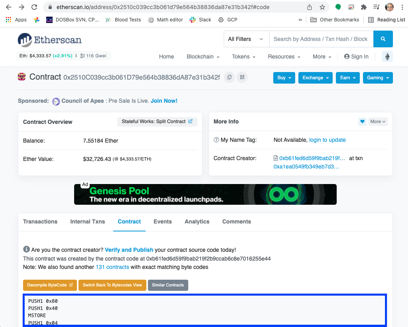

## Introduction {#introduction}

*There are no secrets on the blockchain*, everything that happens should be consistent, verifiable, and publicly available. Ideally, [contracts should have their source code published and verified on Etherscan](https://etherscan.io/address/0xb8901acb165ed027e32754e0ffe830802919727f#code). However, [that is not always the case](https://etherscan.io/address/0x2510c039cc3b061d79e564b38836da87e31b342f#code).

There are reverse compilers, but they don't always produce [usable results](https://etherscan.io/bytecode-decompiler?a=0x2510c039cc3b061d79e564b38836da87e31b342f). In this article you learn how to manually reverse engineer and understand a contract from [the opcodes](https://github.com/wolflo/evm-opcodes).

## Getting the executable code

You can get the opcodes by going to Etherscan for the contract, clicking the **Contract** tab and then **Switch of Opcodes View**. You get a view that is one opcode per line.

