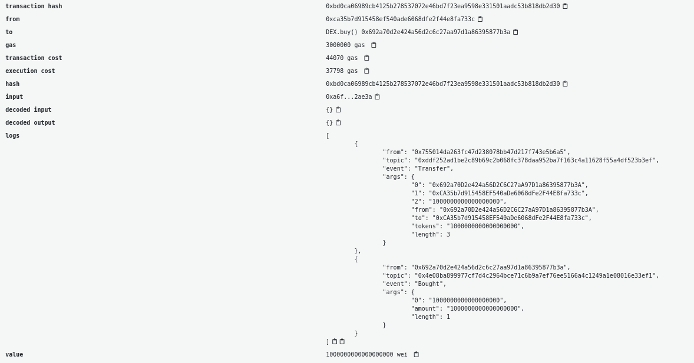
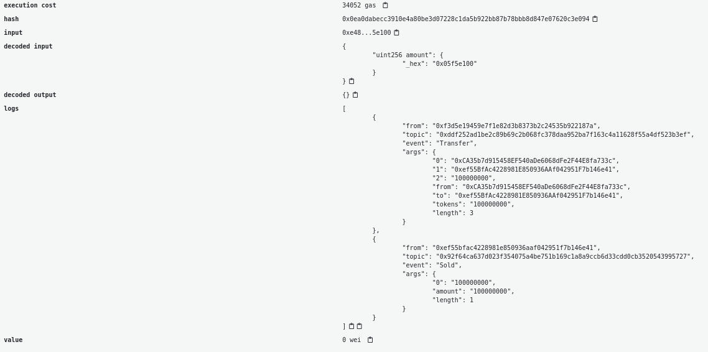

In the previous tutorial we studied [the anatomy of an ERC-20 token in Solidity](/developers/tutorials/understand-the-erc-20-token-smart-contract/) on the Ethereum blockchain. In this article we’ll see how we can use a smart contract to interact with a token using the Solidity language.

For this smart contract, we’ll create a really dummy decentralized exchange where a user can trade Ethereum with our newly deployed [ERC-20 token](/developers/docs/standards/tokens/erc-20/).

For this tutorial we’ll use the code we wrote in the previous tutorial as a base. Our DEX will instantiate an instance of the contract in its constructor and perform the operations of:

- exchanging tokens to ether
- exchanging ether to tokens

We’ll start our Decentralized exchange code by adding our simple ERC20 codebase:

```solidity
pragma solidity ^0.8.0;

interface IERC20 {

    function totalSupply() external view returns (uint256);
    function balanceOf(address account) external view returns (uint256);
    function allowance(address owner, address spender) external view returns (uint256);

    function transfer(address recipient, uint256 amount) external returns (bool);
    function approve(address spender, uint256 amount) external returns (bool);
    function transferFrom(address sender, address recipient, uint256 amount) external returns (bool);


    event Transfer(address indexed from, address indexed to, uint256 value);
    event Approval(address indexed owner, address indexed spender, uint256 value);
}


contract ERC20Basic is IERC20 {

    string public constant name = "ERC20Basic";
    string public constant symbol = "ERC";
    uint8 public constant decimals = 18;


    mapping(address => uint256) balances;

    mapping(address => mapping (address => uint256)) allowed;

    uint256 totalSupply_ = 10 ether;


   constructor() {
	balances[msg.sender] = totalSupply_;
    }

    function totalSupply() public override view returns (uint256) {
	return totalSupply_;
    }

    function balanceOf(address tokenOwner) public override view returns (uint256) {
        return balances[tokenOwner];
    }

    function transfer(address receiver, uint256 numTokens) public override returns (bool) {
        require(numTokens <= balances[msg.sender]);
        balances[msg.sender] = balances[msg.sender]-numTokens;
        balances[receiver] = balances[receiver]+numTokens;
        emit Transfer(msg.sender, receiver, numTokens);
        return true;
    }

    function approve(address delegate, uint256 numTokens) public override returns (bool) {
        allowed[msg.sender][delegate] = numTokens;
        emit Approval(msg.sender, delegate, numTokens);
        return true;
    }

    function allowance(address owner, address delegate) public override view returns (uint) {
        return allowed[owner][delegate];
    }

    function transferFrom(address owner, address buyer, uint256 numTokens) public override returns (bool) {
        require(numTokens <= balances[owner]);
        require(numTokens <= allowed[owner][msg.sender]);

        balances[owner] = balances[owner]-numTokens;
        allowed[owner][msg.sender] = allowed[owner][msg.sender]+numTokens;
        balances[buyer] = balances[buyer]+numTokens;
        emit Transfer(owner, buyer, numTokens);
        return true;
    }
}


```

Our new DEX smart contract will deploy the ERC-20 and get all the supplied:

```solidity
contract DEX {

    IERC20 public token;

    event Bought(uint256 amount);
    event Sold(uint256 amount);

    constructor() {
        token = new ERC20Basic();
    }

    function buy() payable public {
        // TODO
    }

    function sell(uint256 amount) public {
        // TODO
    }

}
```

So we now have our DEX and it has all the token reserve available. The contract has two functions:

- `buy`: The user can send ether and get tokens in exchange
- `sell`: The user can decide to send tokens to get ether back

## The buy function {#the-buy-function}

Let’s code the buy function. We’ll first need to check the amount of ether the message contains and verify that the contracts own enough tokens and that the message has some ether in it. If the contract owns enough tokens it’ll send the number of tokens to the user and emit the `Bought` event.

Note that if we call the require function in the case of an error the ether sent will directly be reverted and given back to the user.

To keep things simple, we just exchange 1 token for 1 Wei.

```solidity
function buy() payable public {
    uint256 amountTobuy = msg.value;
    uint256 dexBalance = token.balanceOf(address(this));
    require(amountTobuy > 0, "You need to send some Ether");
    require(amountTobuy <= dexBalance, "Not enough tokens in the reserve");
    token.transfer(msg.sender, amountTobuy);
    emit Bought(amountTobuy);
}
```

In the case where the buy is successful we should see two events in the transaction: The token `Transfer` and the `Bought` event.



## The sell function {#the-sell-function}

The function responsible for the sell will first require the user to have approved the amount by calling the approve function beforehand. Approving the transfer requires the ERC20Basic token instantiated by the DEX to be called by the user. This can be achieved by first calling the DEX contract's `token()` function to retrieve the address where DEX deployed the ERC20Basic contract called `token`. Then we create an instance of that contract in our session and call its `approve` function. Then we are able to call the DEX's `sell` function and swap our tokens back for ether. For example, this is how this looks in an interactive brownie session:

```python
#### Python in interactive brownie console...

# deploy the DEX
dex = DEX.deploy({'from':account1})

# call the buy function to swap ether for token
# 1e18 is 1 ether denominated in wei
dex.buy({'from': account2, 1e18})

# get the deployment address for the ERC20 token
# that was deployed during DEX contract creation
# dex.token() returns the deployed address for token
token = ERC20Basic.at(dex.token())

# call the token's approve function
# approve the dex address as spender
# and how many of your tokens it is allowed to spend
token.approve(dex.address, 3e18, {'from':account2})

```

Then when the sell function is called, we’ll check if the transfer from the caller address to the contract address was successful and then send the Ethers back to the caller address.

```solidity
function sell(uint256 amount) public {
    require(amount > 0, "You need to sell at least some tokens");
    uint256 allowance = token.allowance(msg.sender, address(this));
    require(allowance >= amount, "Check the token allowance");
    token.transferFrom(msg.sender, address(this), amount);
    payable(msg.sender).transfer(amount);
    emit Sold(amount);
}
```

If everything works you should see 2 events (a `Transfer` and `Sold`) in the transaction and your token balance and Ethereum balance updated.



<Divider />

From this tutorial we saw how to check the balance and allowance of an ERC-20 token and also how to call `Transfer` and `TransferFrom` of an ERC20 smart contract using the interface.

Once you make a transaction we have a Javascript tutorial to [wait and get details about the transactions](https://ethereumdev.io/waiting-for-a-transaction-to-be-mined-on-ethereum-with-js/) that were made to your contract and a [tutorial to decode events generated by token transfers or any other events](https://ethereumdev.io/how-to-decode-event-logs-in-javascript-using-abi-decoder/) as long as you have the ABI.

Here is the complete code for the tutorial:

```solidity
pragma solidity ^0.8.0;

interface IERC20 {

    function totalSupply() external view returns (uint256);
    function balanceOf(address account) external view returns (uint256);
    function allowance(address owner, address spender) external view returns (uint256);

    function transfer(address recipient, uint256 amount) external returns (bool);
    function approve(address spender, uint256 amount) external returns (bool);
    function transferFrom(address sender, address recipient, uint256 amount) external returns (bool);


    event Transfer(address indexed from, address indexed to, uint256 value);
    event Approval(address indexed owner, address indexed spender, uint256 value);
}


contract ERC20Basic is IERC20 {

    string public constant name = "ERC20Basic";
    string public constant symbol = "ERC";
    uint8 public constant decimals = 18;


    mapping(address => uint256) balances;

    mapping(address => mapping (address => uint256)) allowed;

    uint256 totalSupply_ = 10 ether;


   constructor() {
	balances[msg.sender] = totalSupply_;
    }

    function totalSupply() public override view returns (uint256) {
	return totalSupply_;
    }

    function balanceOf(address tokenOwner) public override view returns (uint256) {
        return balances[tokenOwner];
    }

    function transfer(address receiver, uint256 numTokens) public override returns (bool) {
        require(numTokens <= balances[msg.sender]);
        balances[msg.sender] = balances[msg.sender]-numTokens;
        balances[receiver] = balances[receiver]+numTokens;
        emit Transfer(msg.sender, receiver, numTokens);
        return true;
    }

    function approve(address delegate, uint256 numTokens) public override returns (bool) {
        allowed[msg.sender][delegate] = numTokens;
        emit Approval(msg.sender, delegate, numTokens);
        return true;
    }

    function allowance(address owner, address delegate) public override view returns (uint) {
        return allowed[owner][delegate];
    }

    function transferFrom(address owner, address buyer, uint256 numTokens) public override returns (bool) {
        require(numTokens <= balances[owner]);
        require(numTokens <= allowed[owner][msg.sender]);

        balances[owner] = balances[owner]-numTokens;
        allowed[owner][msg.sender] = allowed[owner][msg.sender]+numTokens;
        balances[buyer] = balances[buyer]+numTokens;
        emit Transfer(owner, buyer, numTokens);
        return true;
    }
}


contract DEX {

    event Bought(uint256 amount);
    event Sold(uint256 amount);


    IERC20 public token;

    constructor() {
        token = new ERC20Basic();
    }

    function buy() payable public {
        uint256 amountTobuy = msg.value;
        uint256 dexBalance = token.balanceOf(address(this));
        require(amountTobuy > 0, "You need to send some Ether");
        require(amountTobuy <= dexBalance, "Not enough tokens in the reserve");
        token.transfer(msg.sender, amountTobuy);
        emit Bought(amountTobuy);
    }

    function sell(uint256 amount) public {
        require(amount > 0, "You need to sell at least some tokens");
        uint256 allowance = token.allowance(msg.sender, address(this));
        require(allowance >= amount, "Check the token allowance");
        token.transferFrom(msg.sender, address(this), amount);
        payable(msg.sender).transfer(amount);
        emit Sold(amount);
    }

}
```
