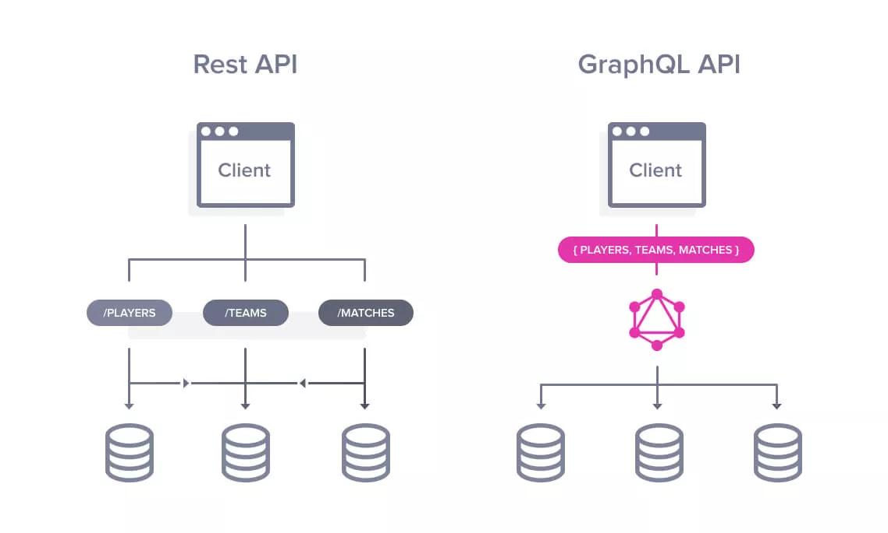
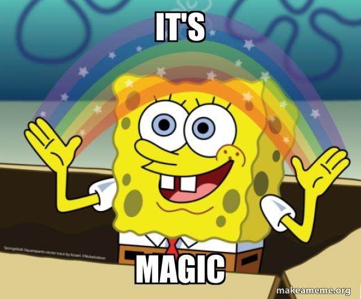

Tym razem przyjrzymy się bliżej protokołowi The Graph, który zasadniczo stał się częścią standardowego stosu do tworzenia aplikacji dapps w zeszłym roku. Zobaczmy najpierw, jak zrobilibyśmy rzeczy w tradycyjny sposób...

## Bez The Graph... {#without-the-graph}

Przejdźmy więc do prostego przykładu w celach ilustracyjnych. Wszyscy lubimy gry, więc wyobraźmy sobie prostą grę z użytkownikami zakładów:

```solidity
pragma solidity 0.7.1;

contract Game {
    uint256 totalGamesPlayerWon = 0;
    uint256 totalGamesPlayerLost = 0;
    event BetPlaced(address player, uint256 value, bool hasWon);

    function placeBet() external payable {
        bool hasWon = evaluateBetForPlayer(msg.sender);

        if (hasWon) {
            (bool success, ) = msg.sender.call{ value: msg.value * 2 }('');
            require(success, "Transfer failed");
            totalGamesPlayerWon++;
        } else {
            totalGamesPlayerLost++;
        }

        emit BetPlaced(msg.sender, msg.value, hasWon);
    }
}
```

Załóżmy teraz, że w naszej aplikacji dapp chcemy wyświetlić całkowitą liczbę przegranych/wygranych gier, a także aktualizować ją za każdym razem, gdy ktoś gra ponownie. Podejście byłoby następujące:

1. Pobierz `totalGamesPlayerWon`.
2. Pobierz `totalGamesPlayerlost`.
3. Subskrybuj zdarzenia `BetPlaceed`.

Możemy nasłuchiwać zdarzeń [w sieci Web3](https://web3js.readthedocs.io/en/v1.2.11/web3-eth-contract.html#contract-events), jak widać po prawej stronie, ale wymaga to obsługi kilku przypadków.

```solidity
GameContract.events.BetPlaced({
    fromBlock: 0
}, function(error, event) { console.log(event); })
.on('data', function(event) {
    // event fired
})
.on('changed', function(event) {
    // event was removed again
})
.on('error', function(error, receipt) {
    // tx rejected
});
```

W naszym prostym przykładzie jest to nadal poniekąd w porządku. Ale powiedzmy, że chcemy teraz wyświetlać kwoty przegranych/wygranych zakładów tylko dla aktualnego gracza. Cóż, nie mamy szczęścia, lepiej wdrożyć nowy kontrakt, który przechowuje te wartości i je pobiera. A teraz wyobraź sobie znacznie bardziej skomplikowany inteligentny kontrakt i dapp, rzeczy mogą szybko się popsuć.


Możesz zobaczyć, że to nieoptymalne:

- Nie działa dla już wdrożonych kontraktów.
- Dodatkowe koszty gazu za przechowywanie tych wartości.
- Wymaga kolejnego wywołania w celu pobrania danych dla węzła Ethereum.


Spójrzmy teraz na lepsze rozwiązanie.

## Pozwól, że przedstawię Ci GraphQL {#let-me-introduce-to-you-graphql}

Najpierw porozmawiajmy o GraphQL, pierwotnie zaprojektowanym i zaimplementowanym przez Facebooka. Być może znasz tradycyjny model Rest API. Teraz wyobraź sobie, że zamiast tego możesz napisać zapytanie dla dokładnie tych danych, które chciałeś:



<!-- TODO gif embed not working: -->
<!-- Need additional plugin? https://github.com/gatsbyjs/gatsby/issues/7317#issuecomment-412984851 -->
<!-- !\[GraphQL example query GIF\](./graphql-query.gif) -->


Te dwa obrazy w dużym stopniu oddają istotę GraphQL. Za pomocą zapytania po prawej stronie możemy zdefiniować dokładnie, jakich danych chcemy, dzięki czemu otrzymujemy wszystko w jednym żądaniu i nic więcej niż dokładnie to, czego potrzebujemy. Serwer GraphQL obsługuje pobieranie wszystkich wymaganych danych, dzięki czemu jest niezwykle łatwy w użyciu dla użytkownika frontendu. [To dobre wyjaśnienie](https://www.apollographql.com/blog/graphql-explained-5844742f195e/), jak dokładnie serwer obsługuje zapytanie, jeśli jesteś zainteresowany.

Teraz, mając tę ​​wiedzę, w końcu wskoczmy w przestrzeń blockchain i The Graph.

## Co to jest The Graph? {#what-is-the-graph}

Blockchain to zdecentralizowana baza danych, ale w przeciwieństwie do tego, co zwykle ma miejsce, nie mamy języka zapytań dla tej bazy danych. Rozwiązania do odzyskiwania danych są bolesne lub całkowicie niemożliwe. The Graph to zdecentralizowany protokół do indeksowania i odpytywania danych blockchain. I mogłeś się domyślić, że używa GraphQL jako języka zapytań.


Przykłady są zawsze najlepsze, aby coś zrozumieć, więc użyjmy The Graph dla naszego przykładu GameContract.

## Jak stworzyć Subgraph {#how-to-create-a-subgraph}

Definicja sposobu indeksowania danych nazywana jest subgraph. Wymaga trzech komponentów:

1. Manifest (subgraf.yaml)
2. Schemat (schema.graphql)
3. Mapping (mapping.ts)

### Manifest (subgraf.yaml) {#manifest}

Manifest jest naszym plikiem konfiguracyjnym i definiuje:

- które inteligentne kontrakty indeksować (adres, sieć, ABI...)
- jakich zdarzeń nasłuchiwać
- inne rzeczy do słuchania, takie jak wywołania funkcji lub bloki
- wywoływane funkcje mapujące (zobacz mapping.ts poniżej)

Tutaj możesz zdefiniować wiele kontraktów i programów obsługi. Typowa konfiguracja miałaby folder podrzędny wewnątrz projektu Truffle/Hardhat z własnym repozytorium. Wtedy możesz łatwo odwołać się do ABI.

Dla wygody możesz również użyć narzędzia szablonu, takiego jak wąsy. Następnie tworzysz subgraph.template.yaml i wstawiasz adresy oparte na najnowszych wdrożeniach. Aby zapoznać się z bardziej zaawansowaną przykładową konfiguracją, zobacz na przykład [Repozytorium subgrafów Aave](https://github.com/aave/aave-protocol/tree/master/thegraph).

A pełną dokumentację można zobaczyć tutaj: https://thegraph.com/docs/define-a-subgraph#the-subgraph-manifest.

```yaml
specVersion: 0.0.1
description: Placing Bets on Ethereum
repository: - Github link -
schema:
  file: ./schema.graphql
dataSources:
  - kind: ethereum/contract
    name: GameContract
    network: mainnet
    source:
      address: '0x2E6454...cf77eC'
      abi: GameContract
      startBlock: 6175244
    mapping:
      kind: ethereum/events
      apiVersion: 0.0.1
      language: wasm/assemblyscript
      entities:
        - GameContract
      abis:
        - name: GameContract
          file: ../build/contracts/GameContract.json
      eventHandlers:
        - event: PlacedBet(address,uint256,bool)
          handler: handleNewBet
      file: ./src/mapping.ts
```

### Schemat (schema.graphql) {#schema}

Schematem jest definicja danych GraphQL. Pozwoli to na zdefiniowanie istniejących obiektów i ich typów. Obsługiwane typy z wykresu to

- Bajty
- ID
- Tekst
- Boolean
- Wewnątrz
- BigInt
- BigDecimal

Możesz również używać obiektów jako typu do definiowania relacji. W naszym przykładzie definiujemy relacje od gracza do zakładów. ! oznacza, że ​​wartość nie może być pusta. Pełną dokumentację można zobaczyć tutaj: https://thegraph.com/docs/define-a-subgraph#the-graphql-schema.

```graphql
type Bet @entity {
  id: ID!
  player: Player!
  playerHasWon: Boolean!
  time: Int!
}

type Player @entity {
  id: ID!
  totalPlayedCount: Int
  hasWonCount: Int
  hasLostCount: Int
  bets: [Bet]!
}
```

### Mapping (mapping.ts) {#mapping}

Plik mapowania na wykresie definiuje nasze funkcje, które przekształcają przychodzące zdarzenia w podmioty. Jest napisany w AssemblyScript, podzbiorze Typescript. Oznacza to, że może być skompilowany w WASM (WebAssembly) dla bardziej wydajnego i przenośnego wykonywania mapowania.

Musisz zdefiniować każdą funkcję nazwaną w pliku subgraph.yaml, więc w naszym przypadku potrzebujemy tylko jednego: handleNewBet. Najpierw próbujemy załadować obiekt Gracza z adresu nadawcy w postaci identyfikatora. Jeśli nie istnieje, tworzymy nową jednostkę i wypełniamy ją wartościami początkowymi.

Następnie tworzymy nową jednostkę zakładu. Identyfikatorem dla tego będzie event.transaction.hash.toHex() + "-" + event.logIndex.toString() zapewniający zawsze unikalną wartość. Używanie samego skrótu nie wystarczy, ponieważ ktoś może kilkakrotnie wywoływać funkcję placeBet w jednej transakcji za pośrednictwem inteligentnej umowy.

Na koniec możemy zaktualizować podmiot Player, który będzie zawierał wszystkie dane. Tablice nie mogą być wypychane bezpośrednio, ale muszą zostać zaktualizowane, jak pokazano tutaj. Używamy identyfikatora, aby odnieść się do zakładu. A .save() jest wymagane na końcu do przechowywania obiektu.

Pełną dokumentację można zobaczyć tutaj: https://thegraph.com/docs/define-a-subgraph#writing-mappings. Możesz także dodać dane wyjściowe rejestrowania do pliku mapowania, zobacz [tutaj](https://thegraph.com/docs/assemblyscript-api#api-reference).

```typescript
import { Bet, Player } from "../generated/schema"
import { PlacedBet } from "../generated/GameContract/GameContract"

export function handleNewBet(event: PlacedBet): void {
  let player = Player.load(event.transaction.from.toHex())

  if (player == null) {
    // create if doesn't exist yet
    player = new Player(event.transaction.from.toHex())
    player.bets = new Array<string>(0)
    player.totalPlayedCount = 0
    player.hasWonCount = 0
    player.hasLostCount = 0
  }

  let bet = new Bet(
    event.transaction.hash.toHex() + "-" + event.logIndex.toString()
  )
  bet.player = player.id
  bet.playerHasWon = event.params.hasWon
  bet.time = event.block.timestamp
  bet.save()

  player.totalPlayedCount++
  if (event.params.hasWon) {
    player.hasWonCount++
  } else {
    player.hasLostCount++
  }

  // update array like this
  let bets = player.bets
  bets.push(bet.id)
  player.bets = bets

  player.save()
}
```

## Używanie go w frontendzie {#using-it-in-the-frontend}

Używając czegoś takiego jak Apollo Boost, możesz łatwo zintegrować The Graph z React Dapp (lub Apollo-Vue). Zwłaszcza gdy używasz hooków React i Apollo, pobieranie danych jest tak proste, jak napisanie pojedynczego zapytania GraphQl w twoim komponencie. Typowa konfiguracja może wyglądać tak:

```javascript
// See all subgraphs: https://thegraph.com/explorer/
const client = new ApolloClient({
  uri: "{{ subgraphUrl }}",
})

ReactDOM.render(
  <ApolloProvider client={client}>
    <App />
  </ApolloProvider>,
  document.getElementById("root")
)
```

A teraz możemy napisać na przykład takie zapytanie. Spowoduje to pobranie

- ile razy obecny użytkownik wygrał
- ile razy aktualny użytkownik przegrał
- listę sygnatur czasowych ze wszystkimi jego poprzednimi zakładami

Wszystko w jednym żądaniu do serwera GraphQL.

```javascript
const myGraphQlQuery = gql`
    players(where: { id: $currentUser }) {
      totalPlayedCount
      hasWonCount
      hasLostCount
      bets {
        time
      }
    }
`

const { loading, error, data } = useQuery(myGraphQlQuery)

React.useEffect(() => {
  if (!loading && !error && data) {
    console.log({ data })
  }
}, [loading, error, data])
```



Ale brakuje nam ostatniego elementu układanki, a jest nim serwer. Możesz uruchomić go samodzielnie lub skorzystać z usługi hostowanej.

## Serwer The Graph {#the-graph-server}

### Graph Explorer: usługa hostowana {#graph-explorer-the-hosted-service}

Najprostszym sposobem jest skorzystanie z usługi hostowanej. Postępuj zgodnie z instrukcjami [tutaj](https://thegraph.com/docs/deploy-a-subgraph), aby wdrożyć subgraf. W przypadku wielu projektów można znaleźć istniejące podgrafy w eksploratorze pod adresem https://thegraph.com/explorer/.


### Uruchamianie własnego węzła {#running-your-own-node}

Alternatywnie możesz uruchomić własny węzeł: https://github.com/graphprotocol/graph-node#quick-start. Jednym z powodów, aby to zrobić, może być korzystanie z sieci, która nie jest obsługiwana przez hostowaną usługę. Obecnie obsługiwane są sieć główna, Kovan, Rinkeby, Ropsten, Goerli, PoA-Core, xDAI i Sokol.

## Zdecentralizowana przyszłość {#the-decentralized-future}

GraphQL obsługuje również strumienie dla nowo przychodzących zdarzeń. Nie jest to jeszcze w pełni obsługiwane przez The Graph, ale zostanie wkrótce wydane.

Brakującym aspektem jest jednak wciąż decentralizacja. The Graph w przyszłości ma ostatecznie stać się w pełni zdecentralizowanym protokołem. Oto dwa świetne artykuły, które bardziej szczegółowo wyjaśniają plan:

- https://thegraph.com/blog/the-graph-network-in-depth-part-1
- https://thegraph.com/blog/the-graph-network-in-depth-part-2

Dwa kluczowe aspekty to:

1. Użytkownicy będą płacić indeksatorom za zapytania.
2. Indeksatorzy będą stakować tokeny Graph (GRT).
