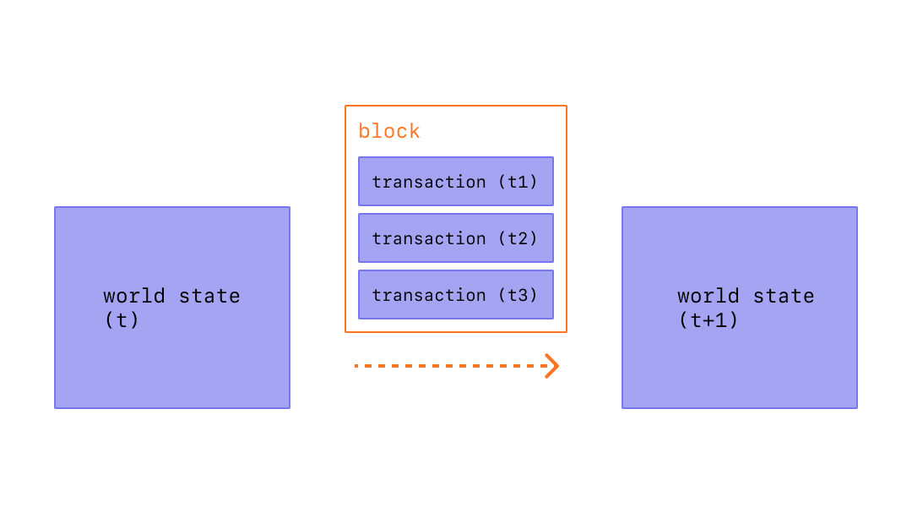

Blocurile sunt loturi de tranzacții cu un hash din blocul anterior din lanț. Acesta leagă blocurile împreună (în lanț) deoarece hash-urile sunt derivate criptografic din datele blocului. Acest lucru previne frauda, pentru că o modificare a oricărui bloc din istoric ar invalida toate blocurile următoare pentru că toate hash-urile ulterioare se vor schimba și toți cei care rulează blockchain-ul vor observa.

## Condiții prealabile {#prerequisites}

Blocurile sunt un subiect foarte prietenos pentru începători. Dar pentru a te ajuta să înțelegi mai bine această pagină, îți recomandăm să citești mai întâi despre [Conturi](/developers/docs/accounts/), [Tranzacții](/developers/docs/transactions/) și [introducere în Ethereum](/developers/docs/intro-to-ethereum/).

<!--The content below was provided by Brian Gu with exception of "what's in a block"-->

## De ce blocuri? {#why-blocks}

Pentru a ne asigura că toți participanții din rețeaua Ethereum mențin o stare sincronizată și convin asupra istoricului precis al tranzacțiilor pe care le grupăm în blocuri. Aceasta înseamnă că zeci (sau sute) de tranzacții sunt comise, convenite și sincronizate simultan.

 _Diagramă adaptată din [Ethereum EVM ilustrat](https://takenobu-hs.github.io/downloads/ethereum_evm_illustrated.pdf)_

Crescând perioada dintre comiteri, acordăm tuturor participanților la rețea suficient timp pentru a ajunge la consens: chiar dacă solicitările de tranzacții apar de zeci de ori pe secundă, blocurile Ethereum sunt executate aproximativ o dată la cincisprezece secunde.

## Cum funcționează blocurile {#how-blocks-work}

Pentru a păstra istoricul tranzacțiilor, blocurile sunt strict ordonate (fiecare bloc nou creat conține o trimitere la blocul părinte) și tranzacțiile din interiorul blocurilor sunt strict ordonate, de asemenea. Cu excepția cazurilor rare, la un moment dat, toți participanții la rețea sunt de acord cu privire la numărul exact și istoricul blocurilor și lucrează pentru a grupa solicitările curente de tranzacții live în blocul următor.

Odată ce un bloc este asamblat (minat) de către un miner din rețea, acesta este propagat către restul rețelei; toate nodurile adaugă acest bloc la sfârșitul blockchain-ului lor, iar exploatarea continuă. Procesul exact de asamblare a blocurilor (minerit) și procesul de angajament/consens sunt specificate în prezent prin protocolul Ethereum „Dovada muncii”.

### O demonstrație vizuală {#a-visual-demo}

<iframe width="100%" height="315" src="https://www.youtube.com/embed/_160oMzblY8" frameborder="0" allow="accelerometer; autoplay; clipboard-write; encrypted-media; gyroscope; picture-in-picture" allowfullscreen mark="crwd-mark"></iframe>

## Protocolul „Dovada muncii” {#proof-of-work-protocol}

Dovada muncii înseamnă următoarele:

- Nodurile miniere trebuie să cheltuiască o cantitate variabilă dar substanțială de energie, timp și putere de calcul pentru a produce un „certificat de legitimitate” pentru un bloc pe care îl propun rețelei. Acest lucru ajută la protejarea rețelei împotriva atacurilor spam/refuz de serviciu, printre altele\*, deoarece certificatele sunt scump de produs.
- Alți mineri care aud despre un bloc nou cu un certificat valid de legitimitate trebuie să accepte noul bloc ca următorul bloc canonic din blockchain.
- Timpul exact necesar pentru ca fiecare miner să producă acest certificat este o variabilă aleatorie cu varianță mare. Acest lucru asigură improbabilitatea* ca doi mineri să producă simultan validări pentru blocul următor propus; atunci când un miner produce și propagă un bloc nou certificat, pot fi aproape siguri că blocul va fi acceptat de rețea ca următorul bloc canonic pe blockchain, fără conflicte* (deși există un protocol pentru tratarea conflictelor în cazul în care două lanțuri de blocuri certificate sunt produse aproape simultan).

[Mai multe despre minerit](/developers/docs/consensus-mechanisms/pow/mining/)

## Ce este într-un bloc? {#block-anatomy}

- Marca de timp – momentul în care blocul a fost extras.
- Număr de blocuri – lungimea blockchain-ului în blocuri.
- Dificultate – efortul necesar pentru minarea blocului.
- mixHash – un identificator unic pentru acel bloc.
- Un hash părinte – identificatorul unic pentru blocul care a apărut înainte (așa se leagă blocurile într-un lanț).
- Lista tranzacțiilor – tranzacțiile incluse în bloc.
- Starea root – întreaga stare a sistemului: soldurile contului, stocarea contractului, codul contractului și nonce-urile contului sunt în interior.
- Nonce – un hash care, atunci când este combinat cu mixHash, dovedește că blocul a trecut prin [dovada muncii](/developers/docs/consensus-mechanisms/pow/).

## Mărimea blocului {#block-size}

O ultimă notă importantă este că blocurile însele sunt limitate ca dimensiune. Fiecare bloc are o limită de gaz pe bloc care este stabilită de rețea și de mineri în mod colectiv: cantitatea totală de gaz cheltuită de toate tranzacțiile din bloc trebuie să fie mai mică decât limita de gaz pe bloc. Acest lucru este important, deoarece asigură că blocurile nu pot fi prea mari. Dacă blocurile ar putea fi în mod arbitrar mari, atunci nodurile complete mai puțin performante ar înceta treptat să poată ține pasul cu rețeaua din cauza cerințelor de spațiu și viteză. Limita de gaz pe bloc la blocul 0 a fost inițiată la 5.000; orice miner care extrage un bloc nou poate modifica limita de gaz cu până la aproximativ 0,1% în ambele direcții de la limita de gaz a blocului părinte. Limita de gaz din noiembrie 2018 se situează în prezent în jurul valorii de 8.000.000.

## Referințe suplimentare {#further-reading}

_Cunoști o resursă comunitară care te-a ajutat? Editează această pagină și adaug-o!_

## Subiecte corelate {#related-topics}

- [Minarea](/developers/docs/consensus-mechanisms/pow/mining/)
- [Tranzacții](/developers/docs/transactions/)
- [Gaz](/developers/docs/gas/)
