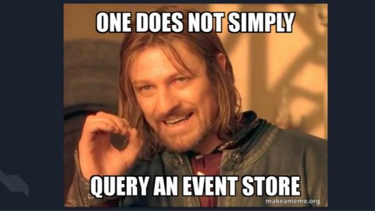
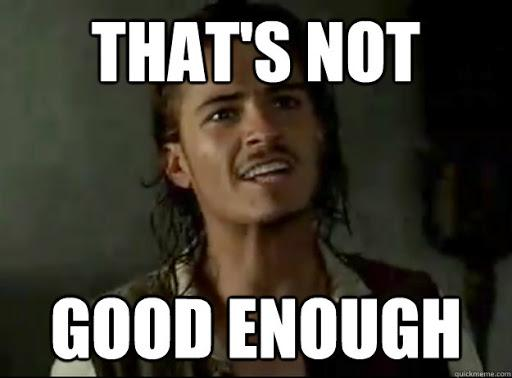
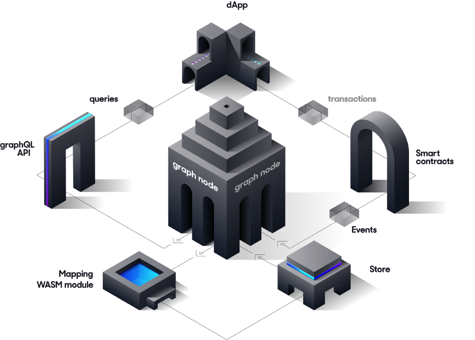
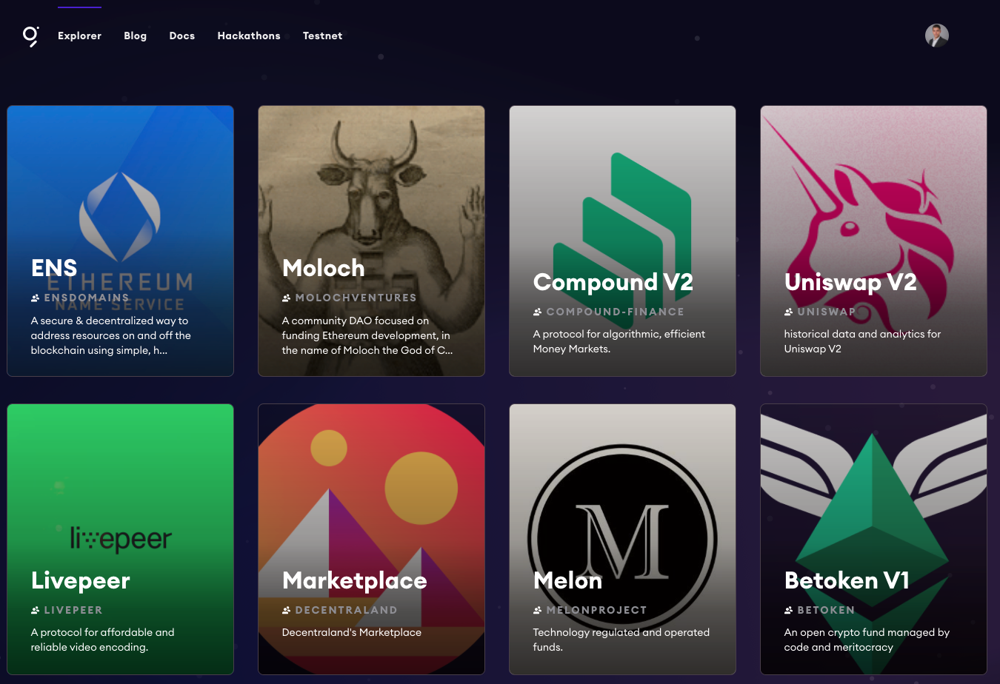

De data aceasta vom arunca o privire mai atentă la „The Graph” care, în esență, a devenit parte din stiva standard pentru dezvoltarea aplicațiilor dapp în ultimul an. Să vedem mai întâi cum am face lucrurile în mod tradițional...

## Fără „The Graph”... {#without-the-graph}

Vom folosi un exemplu simplu în scopul de ilustrare. Tuturor ne plac jocurile, deci să ne imaginăm un joc simplu, cu utilizatori care plasează pariuri:

```solidity
pragma solidity 0.7.1;

contract Game {
    uint256 totalGamesPlayerWon = 0;
    uint256 totalGamesPlayerLost = 0;
    event BetPlaced(address player, uint256 value, bool hasWon);

    function placeBet() external payable {
        bool hasWon = evaluateBetForPlayer(msg.sender);

        if (hasWon) {
            (bool success, ) = msg.sender.call{ value: msg.value * 2 }('');
            require(success, "Transferul nu a reușit");
            totalGamesPlayerWon++;
        } else {
            totalGamesPlayerLost++;
        }

        emit BetPlaced(msg.sender, msg.value, hasWon);
    }
}
```

Acum să spunem că în aplicația noastră dapp, vrem să afișăm totalul jocurilor pierdute/câștigate și, de asemenea, să le actualizăm ori de câte ori cineva joacă din nou. Abordarea ar fi:

1. Preia `totalGamesPlayerWon`.
2. Preia `totalGamesPlayerLost`.
3. Abonează-te la `evenimente BetPlaced`.

Putem asculta [evenimentul în Web3](https://web3js.readthedocs.io/en/v1.2.11/web3-eth-contract.html#contract-events) așa cum se arată în dreapta, dar necesită manipularea destul de multor cazuri.

```solidity
GameContract.events.BetPlaced({
    fromBlock: 0
}, function(error, event) { console.log(event); })
.on('data', function(event) {
    // eveniment declanșat
})
.on('changed', function(event) {
    // evenimentul a fost eliminat din nou
})
.on('error', function(error, receipt) {
    // tx respins
});
```

Acum, acest lucru este încă destul de bun pentru exemplul nostru simplu. Dar să presupunem că vrem să afișăm numai câte pariuri a pierdut/câștigat doar jucătorul actual. Ei bine, nu avem noroc, ar fi bine să implementezi un nou contract care stochează valorile respective și să le afișeze. Și acum să ne imaginăm un contract inteligent și o aplicație dapp mult mai complicate, lucrurile pot deveni repede foarte confuze.



Putem vedea de ce acest lucru nu este optim:

- Nu funcționează pentru contracte deja implementate.
- Costuri suplimentare de gaz pentru stocarea acestor valori.
- Necesită un alt apel pentru a prelua datele pentru un nod Ethereum.



Acum să analizăm o soluție mai bună.

## Permite-mi să-ți prezint GraphQL {#let-me-introduce-to-you-graphql}

În primul rând, să vorbim despre GraphQL, inițial proiectat și implementat de Facebook. Este posibil să fii familiarizat cu modelul tradițional API Rest. Acum imaginează-ți că ai putea scrie o interogare pentru exact datele pe care le-ai dorit:


<!-- TODO gif embed not working: -->
<!-- Need additional plugin? https://github.com/gatsbyjs/gatsby/issues/7317#issuecomment-412984851 -->


Cele două imagini surprind destul de mult esența GraphQL. Cu interogarea din dreapta putem defini exact ce date vrem, astfel încât vom obține totul într-o singură cerere și nimic mai mult decât exact ceea ce avem nevoie. Un server GraphQL se ocupă de preluarea tuturor datelor necesare, astfel încât este incredibil de ușor de partea front-end a consumatorului. [Aceasta este o explicație frumoasă](https://www.apollographql.com/blog/graphql-explained-5844742f195e/) a modului în care serverul gestionează o interogare dacă ești interesat.

Acum, cu aceste cunoștințe, să sărim în cele din urmă în spațiul blockchain și „The Graph”.

## Ce este „The Graph”? {#what-is-the-graph}

Un blockchain este o bază de date descentralizată, dar spre deosebire de ceea ce se întâmplă de obicei, nu avem un limbaj de interogare pentru această bază de date. Soluțiile pentru obținerea datelor sunt dureroase sau complet imposibile. „The Graph” este un protocol descentralizat pentru indexarea și interogarea datelor blockchain. Și s-ar putea să fi ghicit, se utilizează GraphQL ca limbaj de interogare.



Exemplele sunt cele mai bune ca să înțelegem ceva, așa că hai să folosim „The Graph” pentru exemplul nostru „GameContract”

## Cum să creăm un Subgraph {#how-to-create-a-subgraph}

Definiția modului de indexare a datelor se numește „subgraph”. Acesta necesită trei componente:

1. Manifestul (subgraph.yaml)
2. Schema (schema.graphql)
3. Maparea (mapping.ts)

### Manifest (subgraph.yaml) {#manifest}

Manifestul este fișierul nostru de configurare și definește:

- ce contracte inteligente să indexeze (adresa, rețea, ABI...)
- ce evenimente să asculte
- alte lucruri de ascultat, cum ar fi apeluri de funcții sau blocuri
- funcțiile de mapare apelate (vezi mapping.ts mai jos)

Aici poți defini mai multe contracte și manipulatoare. O configurare tipică ar avea un folder subgraph în proiectul Truffle/Hardhat cu propriul depozit. Apoi, poți face cu ușurință referire la ABI.

Din motive de confort, probabil ai vrea să utilizezi un instrument șablon, cum ar fi „mustache”. Apoi să creezi un subgraph.template.yaml și să introduci adresele pe baza celor mai recente implementări. Pentru un exemplu de configurare mai avansat, consultă [depozitul Aave subgraph](https://github.com/aave/aave-protocol/tree/master/thegraph).

Și documentația completă poate fi văzută aici: https://thegraph.com/docs/define-a-subgraph#the-subgraph-manifest.

```yaml
specVersion: 0.0.1
description: Plasarea pariurilor pe Ethereum
repository: - GitHub link -
schema:
  file: ./schema.graphql
dataSources:
  - kind: ethereum/contract
    name: GameContract
    network: mainnet
    source:
      address: '0x2E6454...cf77eC'
      abi: GameContract
      startBlock: 6175244
    mapping:
      kind: ethereum/events
      apiVersion: 0.0.1
      language: wasm/assemblyscript
      entities:
        - GameContract
      abis:
        - name: GameContract
          file: ../build/contracts/GameContract.json
      eventHandlers:
        - event: PlacedBet(address,uint256,bool)
          handler: handleNewBet
      file: ./src/mapping.ts
```

### Schema (schema.graphql) {#schema}

Schema este definiția datelor GraphQL. Aceasta îți va permite să definești ce entități există și tipurile lor. Tipurile acceptate din „The Graph” sunt

- Bytes
- ID
- String
- Boolean
- Int
- BigInt
- BigDecimal

De asemenea, poți utiliza entitățile ca „tip” pentru a defini relațiile. În exemplul nostru definim o relație 1-la-mulți de la jucător la pariuri. Simbolul ! înseamnă că valoarea nu poate fi goală. Documentația completă poate fi consultată aici: https://thegraph.com/docs/define-a-subgraph#the-graphql-schema.

```graphql
type Bet @entity {
  id: ID!
  player: Player!
  playerHasWon: Boolean!
  time: Int!
}

type Player @entity {
  id: ID!
  totalPlayedCount: Int
  hasWonCount: Int
  hasLostCount: Int
  bets: [Bet]!
}
```

### Mapping (mapping.ts) {#mapping}

Fișierul de mapare din „The Graph” definește funcțiile noastre care transformă evenimentele primite în entități. Este scris în AssemblyScript, un subset de Typescript. Deci poate fi compilat în WASM (WebAssembly) pentru executarea mai eficientă și portabilă a mapării.

Va trebui să definești fiecare funcție numită în fișierul subgraph.yaml, deci în cazul nostru avem nevoie doar de una: handleNewBet. Mai întâi încercăm să încărcăm entitatea Player din adresa expeditorului ca id. Dacă nu există, creăm o entitate nouă și o completăm cu valorile inițiale.

Apoi vom crea o nouă entitate Bet. Id-ul pentru aceasta va fi event.transaction.hash.toHex() + "-" + event.logIndex.toString() asigurând întotdeauna o valoare unică. Numai utilizarea hash-ului nu este suficientă deoarece cineva poate apela funcția „placeBet” de mai multe ori într-o singură tranzacție printr-un contract inteligent.

În cele din urmă, putem actualiza entitatea „Player” cu toate datele. Matricele nu pot fi împinse direct, dar trebuie actualizate așa cum se arată aici. Folosim id-ul pentru a face referire la pariu. Și ".save()" este necesară la sfârșit pentru a stoca o entitate.

Documentația completă poate fi consultată aici: https://thegraph.com/docs/define-a-subgraph#writing-mappings. De asemenea, poți adăuga rezultatele jurnalizării în fișierul de mapare, consultă [aici](https://thegraph.com/docs/assemblyscript-api#api-reference).

```typescript
import { Bet, Player } from "../generated/schema"
import { PlacedBet } from "../generated/GameContract/GameContract"

export function handleNewBet(event: PlacedBet): void {
  let player = Player.load(event.transaction.from.toHex())

  if (player == null) {
    // creare dacă nu există încă
    player = new Player(event.transaction.from.toHex())
    player.bets = new Array<string>(0)
    player.totalPlayedCount = 0
    player.hasWonCount = 0
    player.hasLostCount = 0
  }

  let bet = new Bet(
    event.transaction.hash.toHex() + "-" + event.logIndex.toString()
  )
  bet.player = player.id
  bet.playerHasWon = event.params.hasWon
  bet.time = event.block.timestamp
  bet.save()

  player.totalPlayedCount++
  if (event.params.hasWon) {
    player.hasWonCount++
  } else {
    player.hasLostCount++
  }

  // actualizează matrice ca aceasta
  let bets = player.bets
  bets.push(bet.id)
  player.bets = bets

  player.save()
}
```

## Folosindu-l în Front-end {#using-it-in-the-frontend}

Folosind ceva de genul Apollo Boost, poți integra cu ușurință „The Graph” în aplicația ta React Dapp (sau Apollo Vue). Mai ales atunci când utilizezi hooks React și Apollo, preluarea datelor este la fel de simplă ca scrierea unei singure interogări GrafQl în componenta ta. O configurare tipică ar putea arăta astfel:

```javascript
// Vezi toate subgraph-urile: https://thegraph.com/explorer/
const client = new ApolloClient({
  uri: "{{ subgraphUrl }}",
})

ReactDOM.render(
  <ApolloProvider client={client}>
    <App />
  </ApolloProvider>,
  document.getElementById("root")
)
```

Și acum putem scrie, de exemplu, o interogare ca aceasta. Aceasta ne va aduce

- de câte ori a câștigat utilizatorul curent
- de câte ori a pierdut utilizatorul curent
- o listă a marcajelor temporale cu toate pariurile sale anterioare

Toate într-o singură cerere către GraphQL server.

```javascript
const myGraphQlQuery = gql`
    players(where: { id: $currentUser }) {
      totalPlayedCount
      hasWonCount
      hasLostCount
      bets {
        time
      }
    }
`

const { loading, error, data } = useQuery(myGraphQlQuery)

React.useEffect(() => {
  if (!loading && !error && data) {
    console.log({ data })
  }
}, [loading, error, data])
```


Dar ne lipsește o ultimă piesă din puzzle și acesta este serverul. Îl poți rula singur sau poți utiliza serviciul găzduit.

## Serverul „The Graph” {#the-graph-server}

### Exploratorul Graph: Serviciul găzduit {#graph-explorer-the-hosted-service}

Cel mai simplu mod de a utiliza serviciul găzduit. Urmează instrucțiunile [aici](https://thegraph.com/docs/deploy-a-subgraph) pentru a implementa un subgraph. Pentru multe proiecte, poți găsi de fapt, „subgraph”-uri deja realizate în explorer la https://thegraph.com/explorer/.



### Rularea propriului tău nod {#running-your-own-node}

Alternativ, poți rula propriul nod: https://github.com/graphprotocol/graph-node#quick-start. Un motiv pentru a face acest lucru poate fi utilizarea unei rețele care nu este acceptată de serviciul găzduit. În prezent, sunt acceptate rețeaua principală, Kovan, Rinkeby, Ropsten, Goerli, PoA-Core, xDAI și Sokol.

## Viitorul descentralizat {#the-decentralized-future}

GraphQL suportă fluxuri și pentru evenimente nou primite. Acest lucru nu este încă pe deplin susținut de „The Graph”, dar va fi lansat în curând.

Un aspect care lipsește este totuși descentralizarea. „The Graph” are planuri viitoare pentru a deveni în cele din urmă un protocol complet descentralizat. Acestea sunt două articole mari care explică planul în detaliu:

- https://thegraph.com/blog/the-graph-network-in-depth-part-1
- https://thegraph.com/blog/the-graph-network-in-depth-part-2

Două aspecte esențiale sunt:

1. Utilizatorii vor plăti indexurile pentru interogări.
2. Indexurile vor miza tokenuri Graph (GRT).
