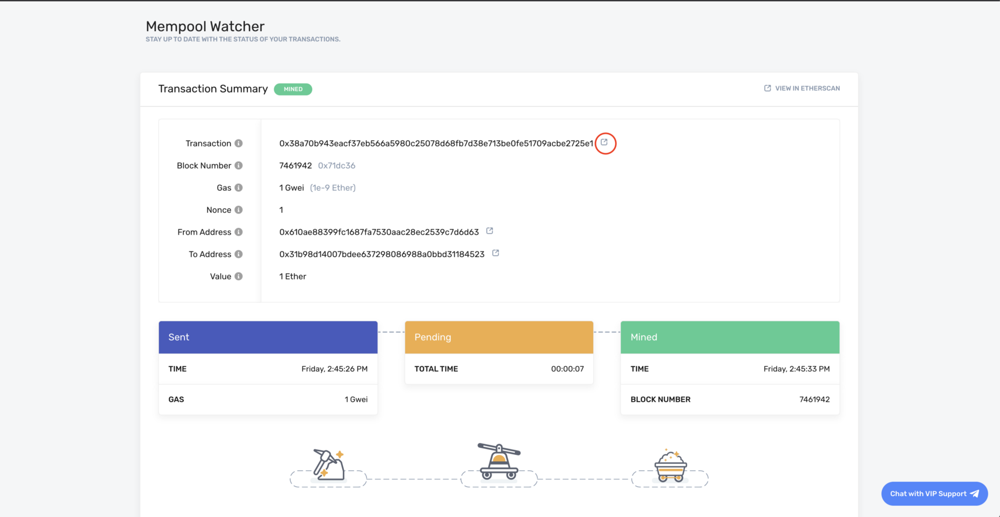

这是使用 web3 和 Alchemy 发送以太坊交易的初学者友好指南。 要向以太坊区块链发送交易，主要有三个步骤：创建、签署和广播。 我们将对这三个方面进行讨论，希望能回答您可能遇到的所有问题！

**注：**本指南用于在*后端*为您的应用程序进行交易，如果您想在前端集成签署您的交易，请查看将 [Alchemy Web3 与浏览器服务提供器](https://docs.alchemyapi.io/documentation/alchemy-web3#with-a-browser-provider)集成。

## 基本概念 {#the-basics}

像大多数区块链开发人员刚开始的时候一样，您可能已经对如何发送交易（应该非常简单）进行了一些研究，然后阅读了大量的指南，发现每个人有不同的解读，让您有点不知所措和困惑。 如果您已上了那条船，就不要担心，我们在某些时候都会这样！ 所以，在开始之前，让我们弄清楚一些事情：

### 1. Alchemy 不会存储您的私钥 {#alchemy-does-not-store-your-private-keys}

- 这意味着 Alchemy 无法代表您签署和发送交易。 这样做的原因是出于安全考虑。 Alchemy 绝不会要求您分享您的私钥，您也绝不应该与托管节点（或任何人）分享您的私钥。
- 您可以使用 Alchemy 的核心 API 读取区块链，但要写入区块链，则需要使用其他东西来签署您的交易，然后再通过 Alchemy 发送交易。

### 2. 什么是 "签名者"？ {#what-is-a-signer}

- 签名者将使用您的私钥为您签署交易。 在本教程中，我们将使用 alchemy web3 来签署我们的交易，但您也可以使用任何其他 web3 库。
- 在前端，[metamask](https://metamask.io/) 就是一个签名者的好例子，它将代表您签署和发送交易。

### 3. 为什么我需要在我的交易上签名？ {#why-do-i-need-to-sign-my-transactions}

- 每个想要在以太坊网络上发送交易的用户都必须在交易上签名（使用他们的私钥），以验证交易的来源是其所声称的那个人。
- 保护这个私钥非常重要，因为拥有这个私钥就可以完全控制您的以太坊帐户，允许您（或任何有权限的人）代表您进行交易。

### 4. 如何保护我的私钥？ {#how-do-i-protect-my-private-key}

- 有许多方法来保护您的私钥，并使用它来发送交易。 在本教程中，我们将使用一个.env 文件。 然而，你也可以使用一个单独的存储私钥的服务提供器，使用一个密钥库文件，或其他选项。

### 5. `eth_sendTransaction` 和 `eth_sendRawTransaction` 之间有什么区别？ {#difference-between-send-and-send-raw}

`eth_sendTransaction` 和 `eth_sendRawTransaction` 都是 Ethereum API 函数，用于将交易广播到 Ethereum 网络，以便将其添加到未来的区块中。 它们在处理交易签名的方式上有所不同。

- [`eth_sendTransaction`](https://web3js.readthedocs.io/en/v1.2.0/web3-eth.html#eth-sendtransaction) 用于发送*未签名的*交易，这意味着您发送到的节点必须管理您的私钥，以便它能够在将交易广播到链中之前对交易进行签名。 由于 Alchemy 并不持有用户的私钥，所以我们不支持这种方法。
- [`eth_sendRawTransactions`](https://docs.alchemyapi.io/documentation/alchemy-api-reference/json-rpc#eth_sendrawtransaction) 用于广播已经签名的交易。 这意味着您首先必须使用 [`signTransaction(tx, private_key)`](https://web3js.readthedocs.io/en/v1.2.0/web3-eth.html#signtransaction)，然后将结果发送到 `eth_sendRawTransaction`。

当使用 web3 时，通过调用函数 [web3.eth.sendSignedTransaction](https://web3js.readthedocs.io/en/v1.2.0/web3-eth.html#sendsignedtransaction) 来访问`eth_sendRawTransaction`。

这是我们将在教程中使用的方法。

### 6. Web3 库是什么？ {#what-is-the-web3-library}

- Web3.js 是一个围绕标准 JSON-RPC 调用的封装库，在以太坊开发中使用相当普遍。
- 有许多针对不同语言的 web3 库。 在本教程中，我们将使用 [Alchemy Web3](https://docs.alchemyapi.io/documentation/alchemy-web3)，它是用 JavaScript 编写的。 您可以在[这里](https://docs.alchemyapi.io/guides/getting-started#other-web3-libraries)查看其他选项 。

好了，现在我们把这些问题都解决了，让我们继续学习教程。 请随时在我们的 [discord](https://discord.gg/sqYmQ7fB) 中提问！

**注：**本指南假设您已有一个 Alchemy 帐户、一个以太坊地址或 Metamask 钱包，并已安装 NodeJs 和 npm。 如果没有，按以下步骤操作：

1.  [创建一个免费的 Alchemy 帐户](https://dashboard.alchemyapi.io/signup/)
2.  [创建 Metamask 帐户](https://metamask.io/)（或获取一个 Etherum 地址）
3.  [按照这些步骤安装 NodeJs 和 NPM](https://medium.com/guides/alchemy-for-macs)

## 发送交易的步骤 {#steps-to-sending-your-transaction}

### 1. 在 Rinkeby 测试网上创建一个 Alchemy 程序 {#create-an-alchemy-app-on-the-rinkeby-testnet}

导航到您的 [Alchemy 仪表板](https://dashboard.alchemyapi.io/)并创建一个新的应用程序，选择 Rinkeby（或任何其他测试网）作为您的网络。

### 2. 从 Rinkeby faucet 请求 ETH {#request-eth-from-rinkeby-faucet}

按照 [Rinkeby faucet](https://faucet.rinkeby.io/) 上的指示来接收 ETH。 您必须要在社交媒体上分享这个特定的 faucet。 确保包括您的 **Rinkeby** 以太坊地址（来自 Metamask）而不是其他网络。 按照说明操作后，仔细检查您的钱包是否已经收到了 ETH。

### 3. 创建一个新的项目目录，并使用 `cd` 命令进入该目录。 {#create-a-new-project-direction}

从命令行（macs 终端）创建一个新的项目目录并导航到这个目录：

```
mkdir sendtx-example
cd sendtx-example
```

### 4. 安装 Alchemy Web3（或任何 web3 库）。 {#install-alchemy-web3}

在您的项目目录中运行以下命令，以安装 [Alchemy Web3](https://docs.alchemyapi.io/documentation/alchemy-web3)。

```
npm install @alch/alchemy-web3
```

### 5. 安装 dotenv {#install-dotenv}

我们将使用一个 .env 文件来安全存储我们的 API 密钥和私钥。

```
npm install dotenv --save
```

### 6. 创建 .env 文件 {#create-the-dotenv-file}

在您的项目目录中创建一个 .env 文件，并添加如下内容（替换“`您的 api-url`" 和 "`您的私人密钥`"）

- 要找到您的 Alchemy API URL，请导航到您刚刚在仪表板上创建的应用程序详细信息页面。 点击右上角的“查看密钥”，然后获取 HTTP URL。
- 要使用 Metamask 找到您的私钥，请参阅这个[指南](https://metamask.zendesk.com/hc/en-us/articles/360015289632-How-to-Export-an-Account-Private-Key)。

```
API_URL = "your-api-url"
PRIVATE_KEY = "your-private-key"
```

### 7. 创建 `sendTx.js` 文件 {#create-sendtx-js}

很好，我们在 .env 文件中保护了我们的敏感数据，让我们现在开始编码吧。 对于我们的发送交易示例，我们将把 ETH 发送回 Rinkeby faucet。

创建一个 `sendTx.js` 文件，这是我们将配置和发送我们的示例交易的地方，并在文件中添加以下几行代码:

在我们开始运行这段代码之前，让我们谈谈这里的一些组件。

- `nonce` : nonce 规范用于跟踪从您的地址发送的交易数量。 为了安全起见，我们需要这样做，以防止[重放攻击](https://docs.alchemyapi.io/resources/blockchain-glossary#account-nonce)。 要获得从您的地址发送的交易数量，我们使用 [getTransactionCount](https://docs.alchemyapi.io/documentation/alchemy-api-reference/json-rpc#eth_gettransactioncount)。
- `transaction`: 交易对象有几个方面需要我们指定
- `to`: 这是我们要发送 ETH 的地址。 在这种情况下，我们将 ETH 发送回我们最初请求的 [Rinkeby faucet](https://faucet.rinkeby.io/)。
- `value`: 这是我们希望发送的金额，以 wei 为单位，10^18 wei = 1 ETH。
- `gas`: 有多种方法来确定与您的交易相关的 gas 的正确数量。 Alchemy 甚至有一个[矿工费出价的 webhook](https://docs.alchemyapi.io/guides/alchemy-notify#address-activity-1)，当矿工费出价落在某个阈值内时，它可以通知您。 对于主网交易， 最好检查一下像 [ETH Gas Station](https://ethgasstation.info/) 这样的 gas 估计器，以确定要包含的正确的 gas 数量。 21000 是以太坊操作所使用的最小 gas 数量，所以为了确保我们的交易得以执行，我们在这里输入 30000。
- `nonce`: 参见上面的 nonce 定义。 Nonce 从零开始计数。
- `signedTx`: 要签署交易对象，我们将使用 `signTransaction` 方法和我们的 `PRIVATE_KEY`
- `sendSignedTransaction`：一旦我们有一个已签名的交易。 我们可以通过使用 `sendSignedTransaction` 将其发送出去，以包含在后续区块中

### 8. 使用 `节点 sendTx.js` 运行代码 {#run-the-code-using-node-sendtx-js}

返回到您的终端或命令行并运行：

```
node sendTx.js
```

### 9. 在内存池中查看您的交易 {#see-your-transaction-in-the-mempool}

在您的 Alchemy 仪表板上打开 [内存池页面](https://dashboard.alchemyapi.io/mempool)，并通过您创建的应用程序进行过滤，以找到您的交易。 我们可以在这里观看交易从待处理状态转换到被挖矿状态（如果成功），或者如果失败，则从待处理状态转换到被丢弃状态。 确保将其保持在“全部”，这样您就能捕捉到“被挖矿”、“待处理”和“被丢弃”的交易。 您还可以通过寻找发送到地址 `0x31b98d14007bdee6372980898a0bbd31184523` 的交易来搜索您的交易。

要在找到交易后查看交易的详细信息，请选择 tx 哈希值，您将看到这样的视图：



在视图里，您可以通过点击红色圆圈圈出的图标，在 Etherscan 上查看您的交易！

**太好了！ 您刚刚使用 Alchemy 发送了您的第一笔以太坊交易 🎉**

_如有关于本指南的反馈和建议，请在 Alchemy 的 [Discord](https://discord.gg/A39JVCM) 上给 Elan 留言！_

_最初发表于 [https://docs.alchemyapi.io/tutorials/sending-transactions-using-web3-and-alchemy](https://docs.alchemyapi.io/tutorials/sending-transactions-using-web3-and-alchemy)。_
